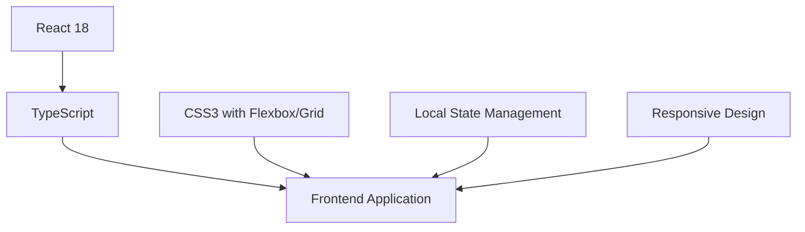
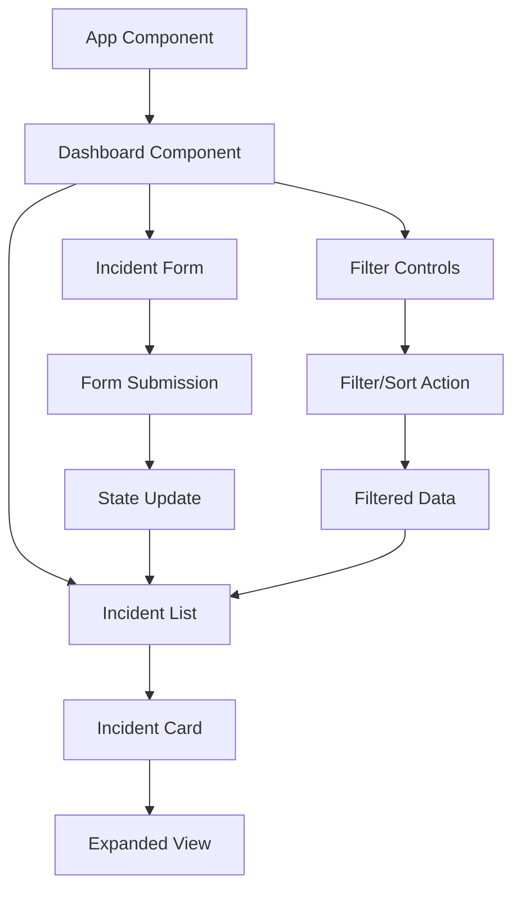

# 🛡️ AI Safety Incident Dashboard 

## 📋 Project Overview

This AI Safety Incident Dashboard is a responsive web application built for HumanChain's take-home assignment. The dashboard provides a comprehensive interface for monitoring, filtering, and reporting AI safety incidents, helping to build a safer, more trustworthy, and human-centric digital world.

### 🌟 Live Demo
Demo Link: https://ai-safety-incident-dashboard04.netlify.app/

## ✨ Features

### 🔍 Incident Monitoring
- **Incident List Display**: Clean, card-based layout showing incident Title, Severity, and Reported Date
- **Detailed View**: Expandable incident cards revealing full descriptions
- **Responsive Design**: Optimized for all screen sizes using Flexbox and Grid layouts

### 🔄 Advanced Filtering & Sorting
- **Severity Filtering**: Filter incidents by severity levels (All, Low, Medium, High)
- **Chronological Sorting**: Sort by newest or oldest incidents
- **Real-time State Updates**: Immediate UI refresh after filtering/sorting

### ➕ Incident Reporting
- **Intuitive Form**: User-friendly interface for reporting new incidents
- **Input Validation**: Ensures all required fields are properly filled
- **Dynamic Updates**: Newly reported incidents appear instantly in the dashboard

### 🎨 UI/UX Highlights
- **Severity Color Coding**: Visual indicators for incident priority
- **Hover Effects**: Interactive elements with smooth transitions
- **Clean Typography**: Optimized for readability
- **Accessibility Focus**: ARIA-compliant components

## 🔧 Technology Stack



- **Framework**: React with TypeScript
- **Styling**: CSS3 with CSS Modules
- **State Management**: React Hooks (useState, useEffect, useReducer)
- **Data Handling**: Local state with mock data

## 🚀 Installation & Setup

1. **Clone the repository**
   ```bash
   git clone https://github.com/your-username/ai-safety-dashboard.git
   cd ai-safety-dashboard
   ```

2. **Install dependencies**
   ```bash
   npm install
   ```

3. **Start the development server**
   ```bash
   npm run dev
   ```


5. **Access the application**
   - Open your browser and navigate to `http://localhost:5173`

## 📊 Project Structure

```
ai-safety-dashboard/
├── public/
│   ├── index.html
│   └── assets/
├── src/
│   ├── components/
│   │   ├── Dashboard/
│   │   │   ├── Dashboard.tsx
│   │   │   └── Dashboard.module.css
│   │   ├── IncidentCard/
│   │   │   ├── IncidentCard.tsx
│   │   │   └── IncidentCard.module.css
│   │   ├── IncidentForm/
│   │   │   ├── IncidentForm.tsx
│   │   │   └── IncidentForm.module.css
│   │   └── FilterControls/
│   │       ├── FilterControls.tsx
│   │       └── FilterControls.module.css
│   ├── models/
│   │   └── incident.model.ts
│   ├── data/
│   │   └── mockData.ts
│   ├── utils/
│   │   └── helpers.ts
│   ├── App.tsx
│   ├── index.tsx
│   └── styles/
│       └── global.css
└── package.json
```

## 🔄 Data Flow Architecture



## 💡 Design Decisions & Challenges

### Architecture Approach
I implemented a component-based architecture with clear separation of concerns. The main Dashboard component orchestrates the interaction between filters, incident list, and the reporting form, while maintaining a single source of truth for the application state.

### State Management Solution
For this project, I used React's built-in state management capabilities rather than introducing external libraries. This decision was made to:
- Keep the bundle size small
- Demonstrate proficiency with React fundamentals
- Maintain simplicity for a project of this scope

### Responsive Design Strategy
The application uses a mobile-first approach with responsive breakpoints to ensure optimal viewing across devices:
- Flexbox for one-dimensional layouts
- CSS Grid for two-dimensional layouts
- Media queries for breakpoint adjustments

### Performance Optimizations
- Memoization of filtered results
- Component lazy-loading
- Optimized re-rendering with proper key usage in lists

## 🧪 Testing

Run the test suite with:
```bash
npm test
```

The application includes:
- Unit tests for individual components
- Integration tests for component interactions
- Basic accessibility tests

## 🔮 Future Enhancements

Given more time, I would implement:
- **Data Persistence**: Using localStorage to persist incidents between sessions
- **Advanced Filtering**: Multiple filter combinations and text search
- **Bulk Actions**: Handling multiple incidents at once
- **Dark Mode**: Theme toggle for improved accessibility
- **Authentication**: User login for secure incident reporting


- 📧 Email at: anupriyasingh534@gmail.com
<div align="center">
  
❤️
  
**Made with love and commitment to safer AI systems**
  
</div>
